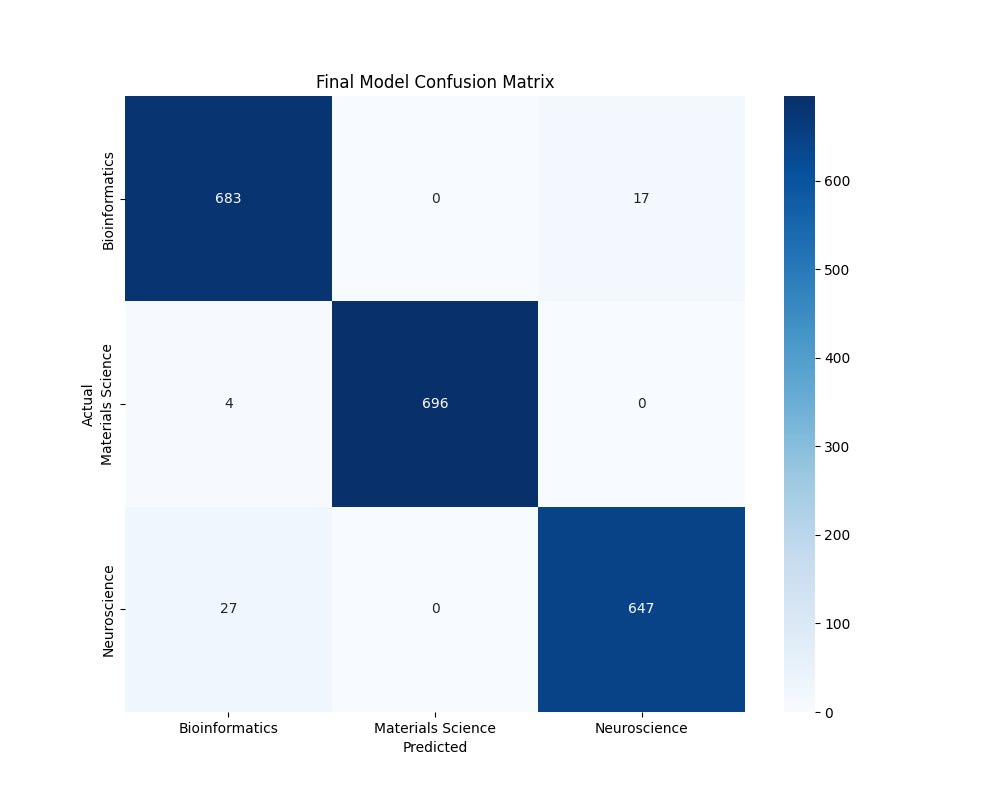
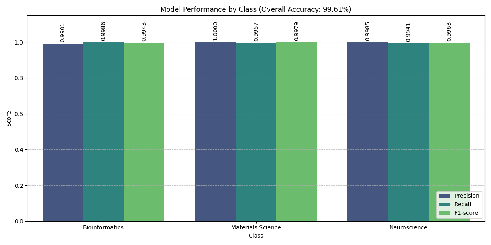

# Scientific Abstract Classifier using a SetFit and Contrastive Learning Fine-tuned Language Model

This repo is made for the completion of the final project for the Artificial Intelligence class. This includes all the past experiments that helped lead me to the final model but was ultimately not used or is of no relevance to the final submission, they are merely for reference and for my personal documentation/tracking.

## Results

The model was trained twice to reduce error and both runs produced very similar performance metrics.

### Run 1 - Confusion Matrix
Shows the classification accuracy across all three scientific domains (Bioinformatics, Neuroscience, Materials Science).



### Run 1 - Class Performance Metrics
Comparison of Precision, Recall, and F1-Score for each scientific domain.


### Run 1 - t-SNE Embedding Visualization
2D visualization of how the model separates the three scientific domains in its learned embedding space.


---

### Run 2 - Confusion Matrix
Second training run showing consistent classification performance.


### Run 2 - Class Performance Metrics
Second run metrics confirming reproducible results.



### Run 2 - t-SNE Embedding Visualization
Second run showing similar cluster separation patterns.


**Note:** The consistency between both runs demonstrates the robustness of the SetFit contrastive learning approach and validates the reliability of the model's performance metrics.

## Quick Start (Running the Classifier)
If you only want to run the final classifier verification and training:

1.  **Install Requirements**:
    ```bash
    pip install -r requirements.txt
    ```

2.  **Run the Main Script**:
    ```bash
    python JonathanSetiawan_aifinal.py
    ```
    *This will train the SetFit model on the augmented dataset, evaluate it, and generate results in `results/figures/` assuming that the dataset is located correctly.*

---

## Dataset Creation (Step-by-Step)
If you wish to reproduce the dataset augmentation process (Context Injection) from scratch, follow these steps:

### 1. Build the Associativity Map
This script analyzes the raw scientific abstracts to find domain-specific keywords and synonyms.
```bash
python preprocessing/build_associativity.py
```
*Output: `data/associativity_map.json`*

### 2. Generate Augmented Dataset
This script uses the map to inject context hints into the raw abstracts, creating the final dataset.
```bash
python preprocessing/generate_augmented_data.py
```
*Output: `data/processed/phase5_augmented_dataset.csv` (Note: The main script expects `augmented_dataset.csv`, so you may need to rename it or update the script if you regenerate it).*

---

## Project Structure
*   `JonathanSetiawan_aifinal.py`: Main execution script for training and evaluation.
*   `data/`: Contains raw and processed datasets.
*   `preprocessing/`: Scripts used to create and augment the dataset.
*   `archive/`: Contains previous experimental code and auxiliary files.
*   `models/`: Stores the trained final model.
*   `results/figures/`: Contains sample output figures from a previous run. These will be overwritten when you run the main script.

## Requirements
Ensure you have the dependencies listed in `requirements.txt` installed. Key libraries include:
*   `setfit`
*   `pandas`
*   `scikit-learn`
*   `matplotlib`
*   `seaborn`
*   `nltk`
