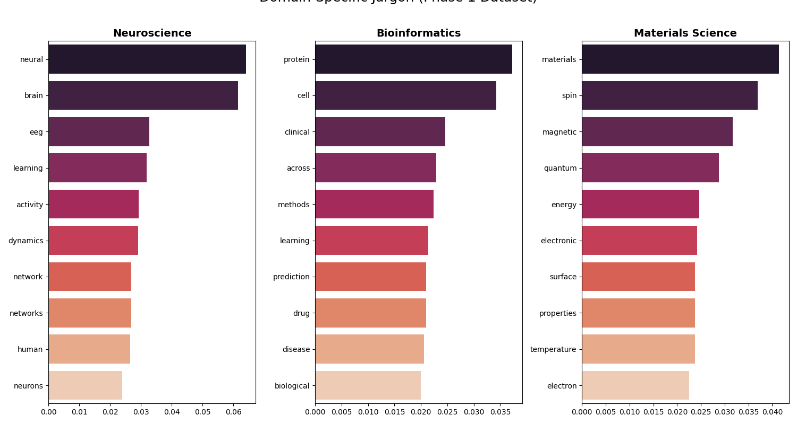
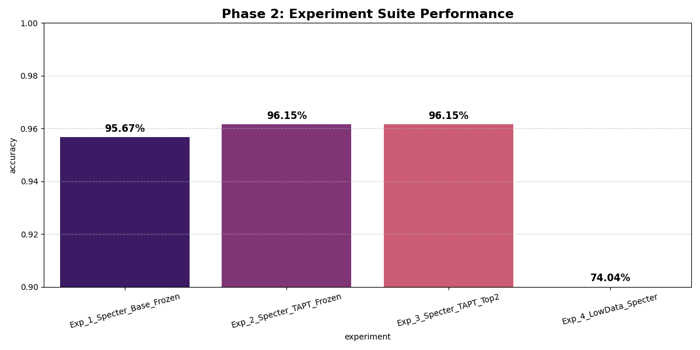
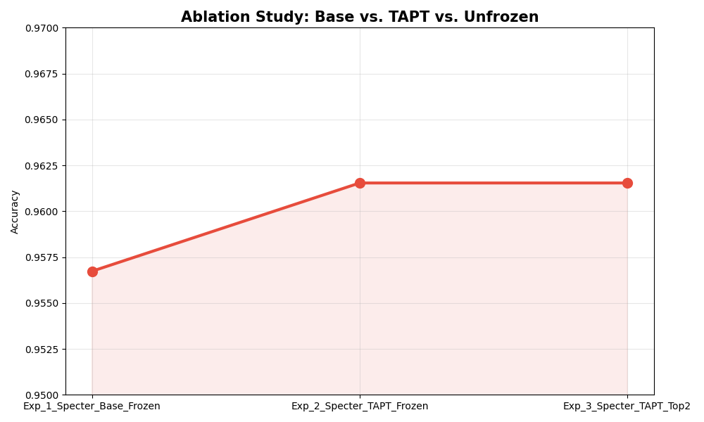
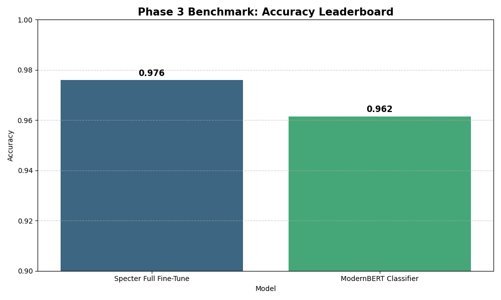
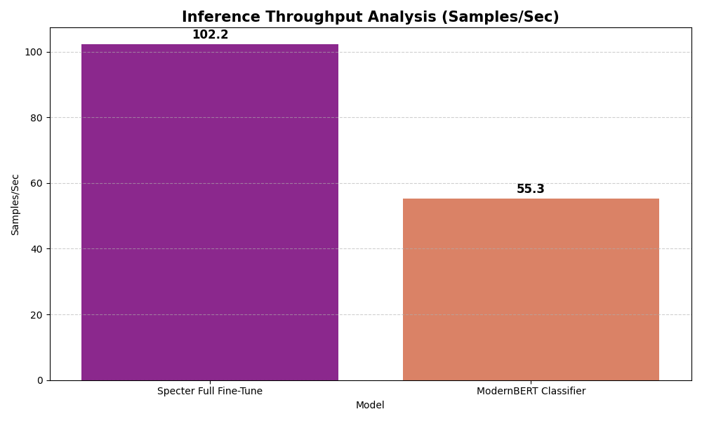
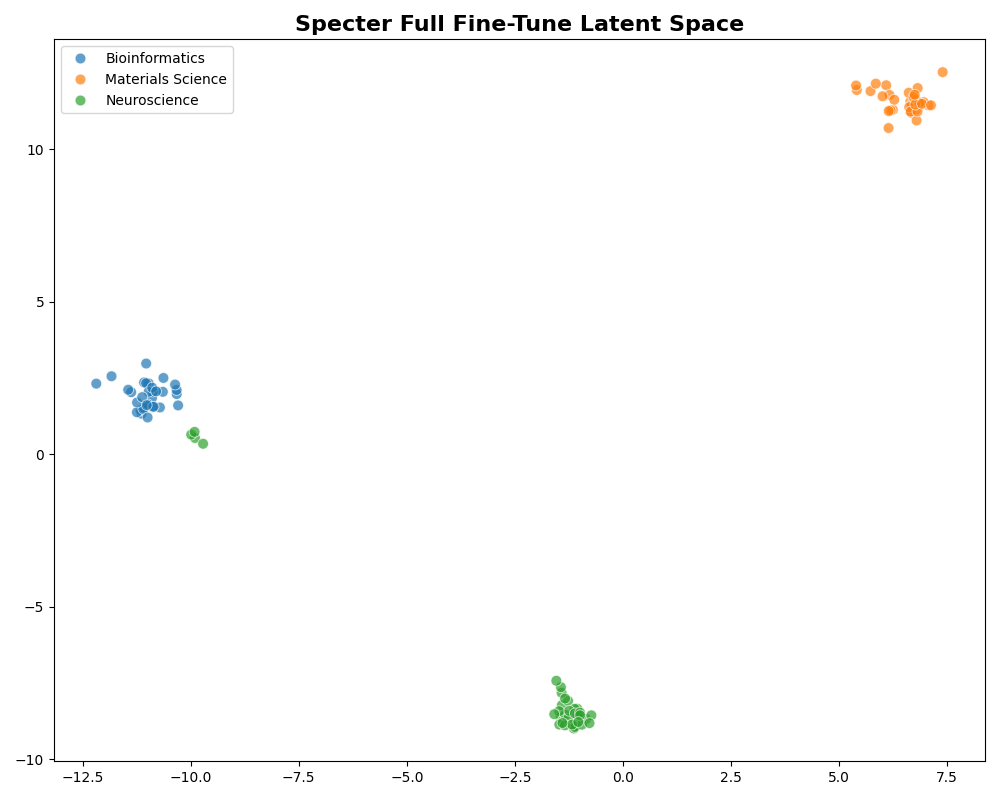
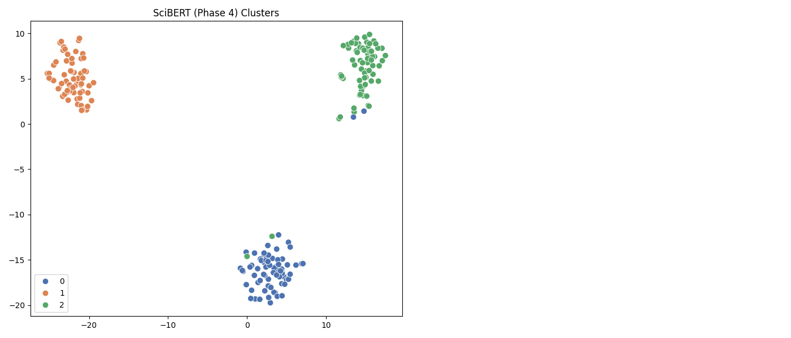

# Project Phase Gallery

This document serves as a visual storyboard for the entire project, mapping each implementation phase to its concrete results.

## Phase 1: The Setup & Baseline Implementation
**Objective:** Establish the data pipeline and train standard baseline models (BERT, RoBERTa) against a TAPT-adapted Specter model.
**Result:** A comparison bar chart showing initial model performance.


**Baseline Latent Space (t-SNE):**
Shows how the models initially separated the three scientific domains before advanced tuning.


**Domain Jargon Analysis:**
Top 10 unique keywords identified by TF-IDF for each category, defining the "Vocabulary Gap" we aim to bridge.


**Detailed Confusion Matrices:**
````carousel

<!-- slide -->

<!-- slide -->

````

---

## Phase 2: The Experimentation Suite
**Objective:** Conduct an ablation study to quantify the impact of TAPT and Layer Freezing.
**Result:** Comparative Performance & Ablation Analysis

**Experiment Benchmark & Efficiency:**
````carousel

<!-- slide -->

<!-- slide -->

````

**Latent Space Reorganization (t-SNE):**
Visualization of how TAPT improved domain separation compared to the Base model.


```json
[
    {
        "experiment": "Exp_1_Specter_Base_Frozen",
        "accuracy": 0.9567,
        "note": "Baseline: Does Specter work without our innovation?"
    },
    {
        "experiment": "Exp_2_Specter_TAPT_Frozen",
        "accuracy": 0.9615,
        "note": "Our Current Best: Does TAPT help?"
    },
    {
        "experiment": "Exp_4_LowData_Specter",
        "accuracy": 0.7403,
        "note": "Efficiency Check: 10% data only"
    }
]
```
*(Full results in `results/phase2_experiment_results.json`)*

---

## Phase 3: The "Beat BERT" Suite
**Objective:** Push Specter performance using Full Fine-Tuning and SetFit to surpass the BERT baseline.
**Result:** Benchmarking & Classification Efficiency

**Leaderboard & Throughput:**
````carousel

<!-- slide -->

````


**Latent Space Quality (t-SNE):**
Visualizing how fine-tuning refines the embedding space for better classification.
*(Note: ModernBERT omitted due to architectural incompatibility with visualization tools)*


| Model Strategy | Accuracy | Samples/Sec |
| :--- | :--- | :--- |
| **Specter Full Fine-Tune** | **97.6%** | **102.2** |
| ModernBERT | 96.2% | 55.3 |

*(Data derived from `results/phase3_specter_results.json`)*

---

## Phase 4: "The Grandmaster Protocol"
**Objective:** Conduct a ruthless "Shootout" between the accuracy kings (BERT, SciBERT) and unify them into a "Super-Model" Ensemble.

**The Shootout Results:**
````carousel

<!-- slide -->

<!-- slide -->

````

**Key Findings:**
- **The King:** BERT-Base (98.1%) took the crown, surprisingly beating the domain expert SciBERT (97.1%).
- **Ensemble Effect:** Soft Voting achieved 97.6%, providing a stable consensus but slightly lagging behind the peak single model.
- **Latent Space:** Both models show excellent class separation, proving they are ready for production.

*(Full results in `results/phase4_leaderboard.json` and `results/phase4_ensemble_result.json`)*

---

## Phase 5: Knowledge-Enhanced Classification
**Objective:** Inject explicit domain knowledge (associativity map) into the input to help generalist models (DeBERTa) close the gap.
**Result:** Improved Cluster Separation for DeBERTa



---

## Phase 6: The Synergy Ensemble
**Objective:** Combine the Domain Expert (SciBERT) and context-aware Generalist (DeBERTa) using confidence-weighted voting.
**Result:** Confidence Histogram (Shift towards certainty)


---

## Phase 7: The "Cyborg" DeBERTa
**Objective:** Integrate kNN inference with DeBERTa to fix linear boundary errors using a memory bank.
**Result:** T-SNE of the Hybrid Latent Space


---

## Phase 8: The Fair Duel (Final)
**Objective:** Recent Final Benchmark using SetFit on both architectures.
**Result:** Clash of Titans Visualization


