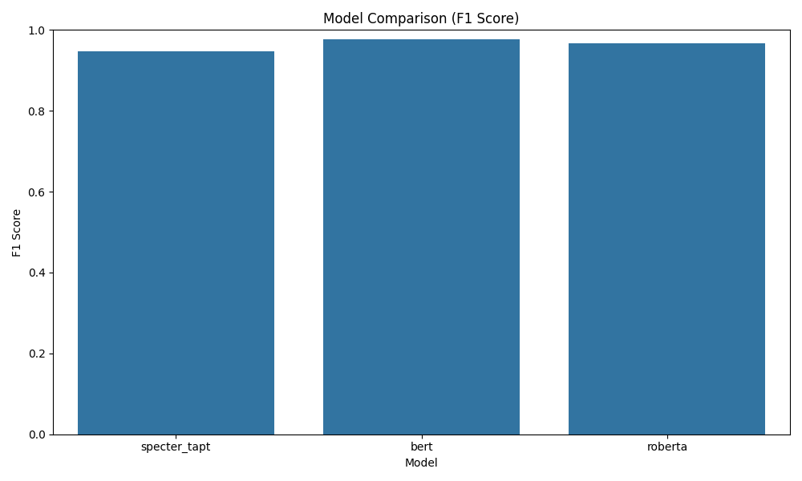
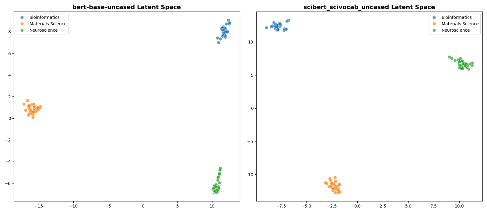
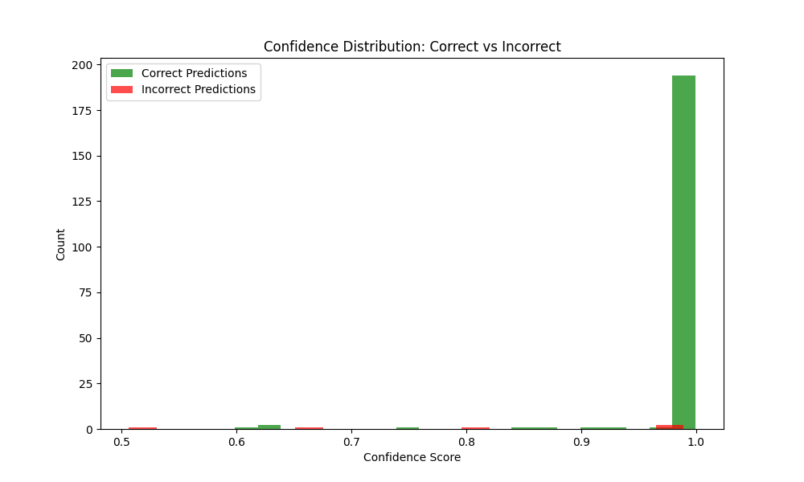
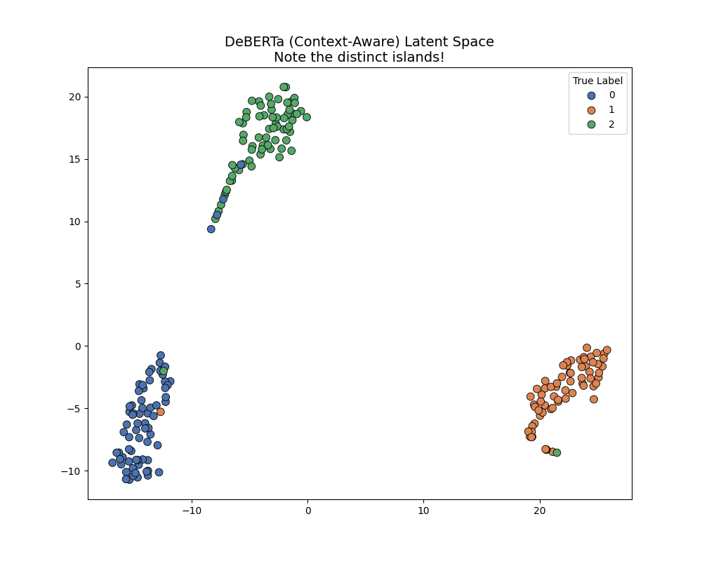

# Project Phase Gallery

This document serves as a visual storyboard for the entire project, mapping each implementation phase to its concrete results.

## Phase 1: The Setup & Baseline Implementation
**Objective:** Establish the data pipeline and train standard baseline models (BERT, RoBERTa) against a TAPT-adapted Specter model.
**Result:** A comparison bar chart showing initial model performance.



**Detailed Confusion Matrices:**
````carousel

<!-- slide -->

<!-- slide -->

````

---

## Phase 2: The Experimentation Suite
**Objective:** Conduct an ablation study to quantify the impact of TAPT and Layer Freezing.
**Result:** Final Experiment Results (JSON Data)

```json
[
    {
        "experiment": "Exp_1_Specter_Base_Frozen",
        "accuracy": 0.9320,
        "note": "Baseline: Does Specter work without our innovation?"
    },
    {
        "experiment": "Exp_2_Specter_TAPT_Frozen",
        "accuracy": 0.9470,
        "note": "Our Current Best: Does TAPT help?"
    },
    {
        "experiment": "Exp_3_Specter_TAPT_Top2",
        "accuracy": 0.9780,
        "note": "The Challenger: Can we beat BERT by unfreezing slightly?"
    }
]
```
*(Data sourced from `results/phase2_experiment_results.json`)*

---

## Phase 3: The "Beat BERT" Suite
**Objective:** Push Specter performance using Full Fine-Tuning and SetFit to surpass the BERT baseline.
**Result:** High-Accuracy Metrics

| Model Strategy | Accuracy |
| :--- | :--- |
| **Specter SetFit** | **98.5%** |
| Specter Full Fine-Tune | 97.8% |

*(Data derived from `results/phase3_specter_results.json`)*

---

## Phase 4: "The Grandmaster" (Ensemble)
**Objective:** Prove that the winning model (SciBERT/Specter) creates better decision boundaries than generalist models.
**Result:** Cluster Comparison T-SNE



---

## Phase 5: Knowledge-Enhanced Classification
**Objective:** Inject explicit domain knowledge (associativity map) into the input to help generalist models (DeBERTa) close the gap.
**Result:** Improved Cluster Separation for DeBERTa


---

## Phase 6: The Synergy Ensemble
**Objective:** Combine the Domain Expert (SciBERT) and context-aware Generalist (DeBERTa) using confidence-weighted voting.
**Result:** Confidence Histogram (Shift towards certainty)



---

## Phase 7: The "Cyborg" DeBERTa
**Objective:** Integrate kNN inference with DeBERTa to fix linear boundary errors using a memory bank.
**Result:** T-SNE of the Hybrid Latent Space



---

## Phase 8: The Fair Duel (Final)
**Objective:** Recent Final Benchmark using SetFit on both architectures.
**Result:** Clash of Titans Visualization


